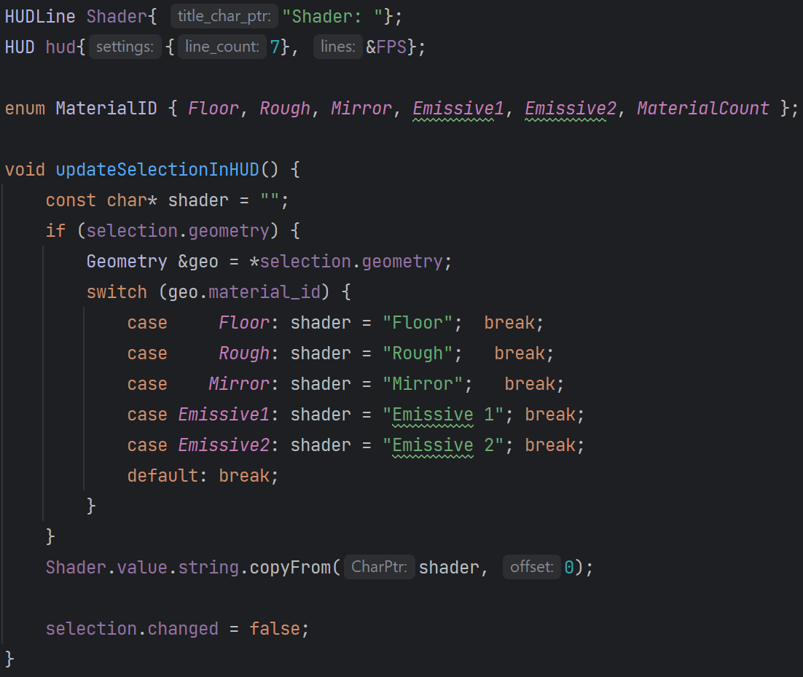
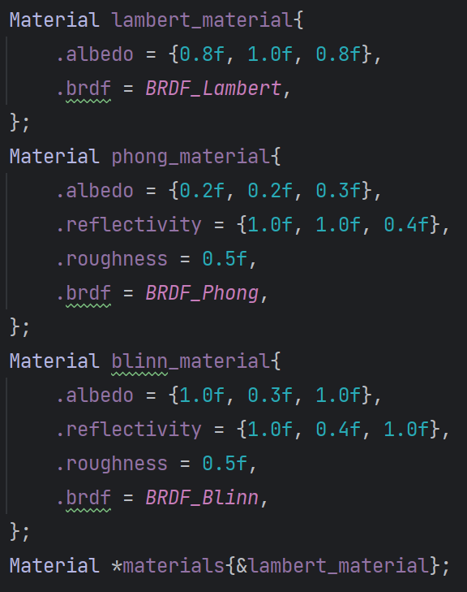
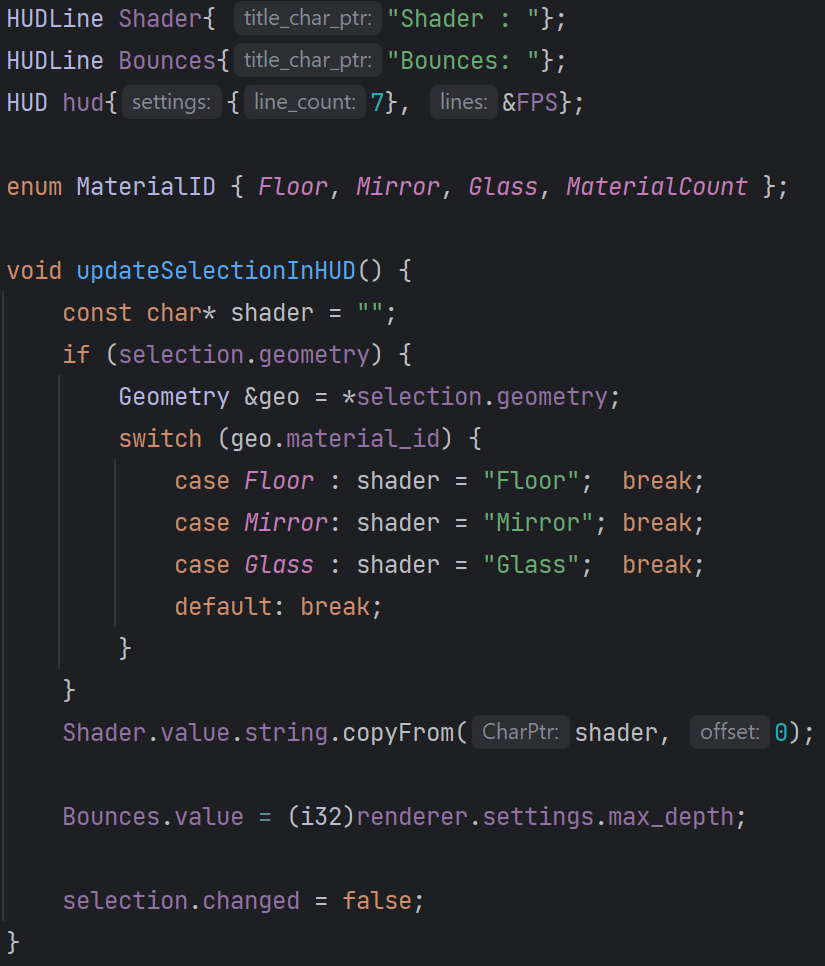
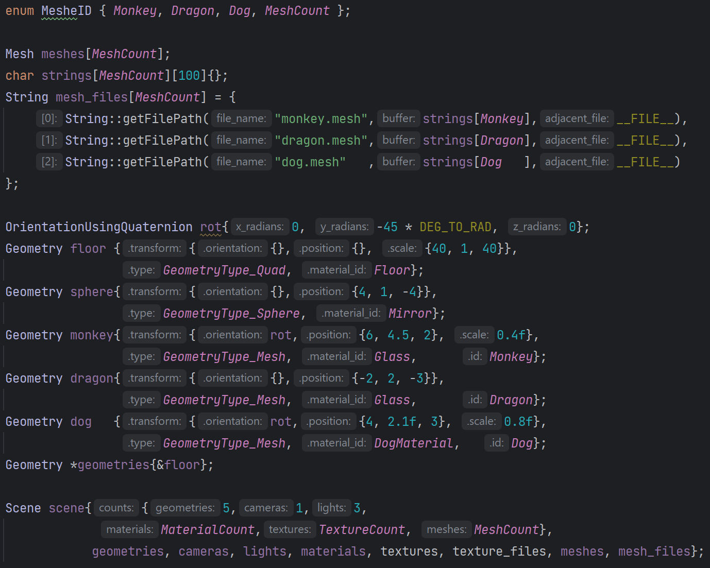

 

 
(Note: For the original SlimTracin 'C' codebase see [SlimTracin](https://github.com/HardCoreCodin/SlimTracin)  

A minimalist and platform-agnostic interactive/real-time raytracer written in C++. 
Strong emphasis on simplicity, ease of use and almost no setup to get started with.   

This project extends [SlimEngine++](https://github.com/HardCoreCodin/SlimEngineCpp).

Optional GPU support is provided via CUDA. 
The same C++ code is cross-compiled (no CUDA libraries used). 
Compiling using CUDA allows for dynamic toggling between rendering on the CPU or the GPU. 

Architecture:
-
The platform layer only uses operating-system headers (no standard library used). 
The application layer itself (non-CUDA) has no dependencies, apart from the standard math header. 
It is just a library that the platform layer uses - it has no knowledge of the platform. 

More details on this architecture [here](https://youtu.be/Ev_TeQmus68).

Features:
-
All features of <b>SlimEngine++</b> are available here as well. 
Additional features include raytracing facilities: 
- Raytracing specific shaders (Glass, Mirror, Area lights)
- Physically based materials (Micro-facet Cook-Torrance BRDF)
- Image Based Lighting (IBL) using Cube Maps for color and irradiance
- Textures with Bi-Linear filtering
- Intersection shaders for triangular meshes and implicit geometry
- Acceleration Structure (BVH) construction and traversal
- Debug render modes (Depth, Normal, UV and BVH-preview)

 
Textures can be loaded from files for use as albedo or normal maps. 
Texture files are in a format native to the renderer and optimized for filtered sampling. 
Textures are mip-mapped and are sampled with adaptive mip-selection using ray cones:  
 
 
 BVHs can be shown as a wireframe overlay in any render mode. 
 
 
The BVH of the scene updates dynamically as primitives are transformed. 
The BVH of meshes are only built once when a mesh file is first created. 
Mesh primitives can be transformed dynamically because tracing is done in the local space of each primitive. 

The following example apps demonstrate how to use <b>SlimTracin</b>'s features: 
<i>Note: Each example comes with CMake targets for CPU-only (no CUDA required) or GPU-enabled (requiring CUDA)</i> 
* <b><u>Point lights</b>:</u> Can be moved around and scaled (changing their light intensity)  
   
  
* <b><u>Area Lights</b>:</u> Emissive quads can be used as rectangular area lights  
    
  
  
* <b><u>Implicit Geometry</b>:</u> Quad, Box, Sphere and Tetrahedra, all with UV-based transparency  
   
  
  
* <b><u>Classic Materials</b>:</u> Lambert, Blinn, Phong  
   
  
  
* <b><u>PBR Materials</b>:</u> Cook-Torrance BRDF (Schlick/Smith GGX)  
   
  
* <b><u>Reflective/Refractive Materials</b>:</u> For glasses and mirrors (bounce count is controlled globally)  
   
  
  
* <b><u>Meshes</b>:</u> Transformable and can have smooth shading using vertex normal interpolation  
   
  
  Mesh files are in a format native to the renderer which is optimized for ray/triangle intersection.  
* <b><u>Render Modes</b>:</u> Beauty, Depth, Normals, UVs and BVHs  
   
  
  

Converting `.bmp` files to the native `.texture` files can be done with a provided CLI tool: 
`./bmp2texture src.bmp trg.texture [-m] [-w]` 
-m : Generate mip-maps 
-w : Wrap-around 

Converting `.obj` files to the native `.mesh` files can be done with a provided CLI tool: 
`./obj2mesh src.obj trg.mesh [-i]` 
-i : Invert triangle winding order (CW to CCW) 
Note: <b>SlimTracin</b>'s `.mesh` files are not the same as <b>SlimEngine</b>'s ones. 

<b>SlimTracin</b> does not come with any GUI functionality at this point. 
Some example apps have an optional HUD (heads up display) that shows additional information. 
It can be toggled on or off using the`tab` key. 

All examples are interactive using <b>SlimTracing</b>'s facilities having 2 interaction modes:
1. FPS navigation (WASD + mouse look + zooming) 
2. DCC application (default) 

Double clicking the `left mouse button` anywhere within the window toggles between these 2 modes.<btr>

Entering FPS mode captures the mouse movement for the window and hides the cursor. 
Navigation is then as in a typical first-person game (plus lateral movement and zooming): 

Move the `mouse` to freely look around (even if the cursor would leave the window border) 
Scroll the `mouse wheel` to zoom in and out (changes the field of view of the perspective) 
Hold `W` to move forward 
Hold `S` to move backward 
Hold `A` to move left 
Hold `D` to move right 
Hold `R` to move up 
Hold `F` to move down 

Exit this mode by double clicking the `left mouse button`.

The default interaction mode is similar to a typical DCC application (i.e: Maya): 
The mouse is not captured to the window and the cursor is visible. 
Holding the `right mouse button` and dragging the mouse orbits the camera around a target. 
Holding the `middle mouse button` and dragging the mouse pans the camera (left, right, up and down). 
Scrolling the `mouse wheel` dollys the camera forward and backward. 

Clicking the `left mouse button` selects an object in the scene that is under the cursor. 
Holding the `left mouse button` while hovering an object and then dragging the mouse, 
moves the object parallel to the screen. 

Holding `alt` highlights the currently selecte object by drawing a bounding box around it. 
While `alt` is still held, if the cursor hovers the selected object's bounding box, 
mouse interaction transforms the object along the plane of the bounding box that the cursor hovers on: 
Holding the `left mouse button` and dragging the mouse moves the object. 
Holding the `right mouse button` and dragging the mouse rotates the object. 
Holding the `middle mouse button` and dragging the mouse scales the object. 
<i>(`mouse wheel` interaction is disabled while `alt` is held)</i> 

In some examples, further interaction is enabled while holding `ctrl` or `shift`  
using the `mouse wheel` as a virtual "slider": 
Holding `shift` and scrolling the `mouse wheel` cycles the assigned material for the selected object. 
Holding `ctrl` and scrolling the `mouse wheel` increases or decreases the ray_tracer-height* 
<i>(how many times rays are allowed to bounce around between reflective or refractive objects)</i> 